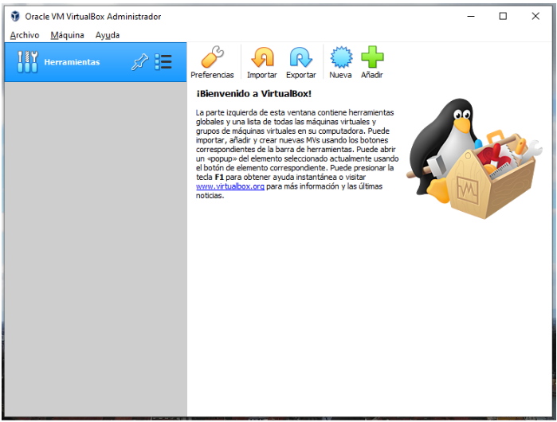

---
hide:
  - toc
tags:
  - instructivos
  - maquina virtual
---

## Puesta en funcionamiento de máquina virtual

Este es un instructivo corto sobre cómo hacer para correr la máquina virtual de la materia en sus compus sin tener que reinstalar el sistema operativo.

Vamos a necesitar:

### Software y archivos a usar
* [Oracle VirtualBox](https://www.virtualbox.org/) instalado en nuestras compus.
* WinZip o GUnzip para Windows o Linux, respectivamente.
* El disco de la máquina virtual (VMDK)

### Requerimientos de Hardware mínimos
* **20 GB** de espacio libre en disco duro (para VMDK)
* **2 GB** de RAM. 

## Antes de arrancar veamos algunas definiciones 

### ¿Qué es un sistema operativo?

Un sistema operativo es una pieza de *software* que nos permite realizar funciones básicas, como copiar/pegar/mover/generar archivos, y sobre el cual se construyen otros softwares. Muchos sistemas operativos también proveen una interfaz gráfica que permite al usuario hacer tareas sin línea de comando (yay!). 

Hay un montón de sistemas operativos, pero los más comunes son:

* Windows: Probablemente el que ustedes tienen en su compu)
* OSX: El que tienen las mac
* Linux: El que vamos a usar en la materia

### ¿Qué es una máquina virtual?

Las máquinas virtuales no son más que compus *invitadas* (o *guests*), emuladas dentro de una computadora real, hospedadora (o *host*). 

La compu de ustedes es la *máquina física* (la computadora real, hospedadora o *host*) y adentro le vamos a poner otra compu virtual.

Las máquinas virtuales corren un sistema operativo que permitirá hacer distintas cosas.

La virtualización es un proceso **costoso**, ya que nos permite crear nuevas compus pero, al momento de correrlas, estaremos repartiendo los recursos reales (espacio en disco, memoria RAM y velocidad de procesamiento CPU) del *host* (es decir, **de nuestra compu**) entre todas las máquinas virtuales *guest* que estén activas.

Es por esto que debemos ser cuidadosos al momento de generarlas, dándoles suficientes recursos para funcionar, pero **no todos** los recursos del *host* (es decir, **de nuestra compu**).

## El disco de máquina virtual

El disco de una máquina virtual es una “foto” de un disco de almacenamiento.

Todo lo que un disco duro tiene guardado, incluyendo el sistema operativo y los programas instalados, quedarán guardados en un archivo cuando la creemos con las herramientas adecuadas. Como no existe un disco duro físico se lo considera *disco virtual*.

Este archivo permite regenerar el estado de la computadora desde la que se creó dicho disco al momento de sacar la foto.

Los docentes ya hemos ensamblado, para la materia, un disco de máquina virtual con Lubuntu 18 (una distribución versión ultra liviana de Ubuntu 18) en la que hemos instalado todos los programas y herramientas que usaremos en la asignatura. En adelante, nos referiremos a éste como IBioinfo.

## Paso 1. Descargar la Máquina Virtual

* Pueden usar este link, que tiene la máquina que usamos en los TPs (es un link a Dropbox).

**Próximamente Link de Descarga**
<!--
[:fontawesome-solid-download: Máquina Virtual](#){ .md-button .md-button--primary }
-->

!!! warning "Atención"

    Son archivos pesados (~ **20GB**). Descárguenlos con **tiempo** y con **conexión estable**.
    
    Si no cuentan con una conexión estable, pueden escribirnos para buscar alguna solución alternativa.

* Una vez descargado el archivo, descomprimir para obtener el `vmdk`.

!!! danger "Elegir la ubicación"
    
    Elijan la ubicación final del archivo `vmdk` ya que una vez creada la Virtual Machine **NO** se puede mover el archivo `.vmdk` de lugar.

## Paso 2. Instalar Virtual Box

* Mientras descarga la imagen, aprovechen el tiempo muerto para descargar Oracle Virtual Box.

* El programa es gratuito y pueden descargarlo desde [la página oficial](https://www.virtualbox.org/).

* Descarguen la última versión (v6.1), apropiada para su sistema operativo (Windows, OSX o Linux) y sigan las instrucciones del instalador hasta que hayan terminado.

## Paso 3. Crear una máquina virtual
Virtual Box es un virtualizador de entornos. Nos permite generar *máquinas virtuales*. Vamos a crear nuestra máquina virtual con el archivo de disco virtual **IBioinfo-Lubuntu-32.vmdk** que acabamos de descargar. Para eso:

1. Abrimos Virtual Box:

    { width="400", align=center }

2. Hacemos click en `New` o `Nueva`

3. Aparecerá una caja de diálogo, en donde deberemos indicar:

    * **Name o Nombre:** Es el nombre que queremos darle a la máquina virtual. Elijan el que quieran.
    * **Machine Folder o Carpeta de Máquina:** Es la ubicación de la máquina virtual. Elijan la que quieran.
    * **Type o Tipo:** Es el tipo de virtualización. Elijan Linux.
    * **Version o Versión:** Es la versión del sistema operativo. Ubuntu 32 bits.

    { width="400", align=center }

4. En el mismo panel deberemos indicar la cantidad de memoria RAM que vamos a *prestarle* a la máquina virtual.

    Pongan la máxima que puedan dentro de la región verde (recuerden que al momento de usar la máquina virtual, ésta sustraerá automáticamente recursos de nuestra compu). 

    Estos valores dependerán de la cantidad de RAM física que tenga nuestro *host*. Cuanto más RAM le demos a la máquina virtual, más rápido va a andar. Para las tareas que realizaremos, darle entre 2 y 4 GB de ram (2048-4096 MB) estará bien.

    { width="400", align=center }

5. Y finalmente el disco duro. Aquí es donde entra nuestro archivo **IBioinfo-Lubuntu.vmdk**:

    { width="400", align=center }
   
    Haciendo click en el icono de la carpeta a la derecha, agregaremos nuestro disco virtual:
    
    *Añadir* --> elegimos nuestro VMDK

    { width="400", align=center }

6. Con esto habremos finalizado la creación y podremos comenzar. Si todo salió bien, deberán ver una entrada con su máquina virtual recientemente creada en el Inicio del Virtual Box.

7. Intenten correr la máquina virtual haciendo click en “Iniciar”. En breve deberían ver el logo de Lubuntu y pronto el escritorio del sistema operativo. 

!!! info "Contraseña"
    Si les pide alguna contraseña, la misma es **unsam**.

!!! danger "No cambiar ubicación"
    Una vez creada la Virtual Machine **NO** muevan el archivo .vmdk de lugar. Si lo hicieron, fíjense en la sección de problemas que está la solución.
