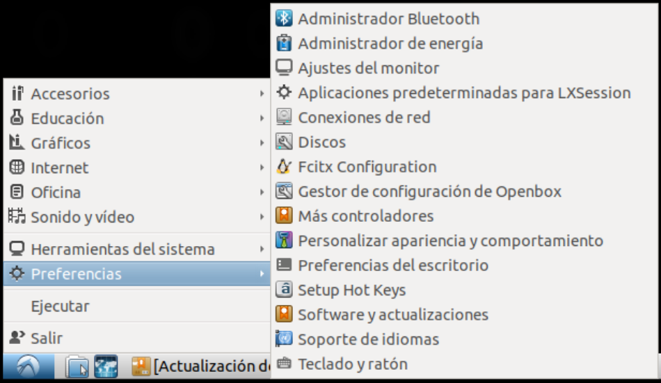
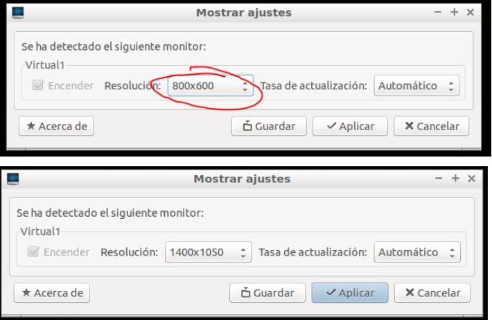
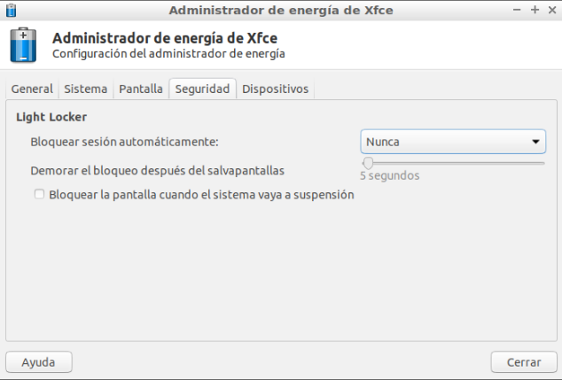

## Resolución de Pantalla
Por defecto, la resolución de la VM es 800x600. Si el monitor o pantalla nos da para agrandar un poco esto, acá les dejo los pasos para hacerlo:

1. Click en el Botón **inicio** de Lubuntu  (esquina inferior izquierda)

2. Click en **Preferencias**

3. Click en **Ajustes del monitor**

    { width="400", align=center }

4. Pasar la resolución a la mayor posible (podemos usar la misma que usamos en el sistema operativo del host)

    { width="400", align=center }

5. Click en **Aplicar** y, si estamos conformes, en **Guardar**.

6. Para que la resolución de pantalla elegida sea permanente:

    Esta versión de lubuntu presenta un bug donde la resolución cambia cada vez que se suspende la VM. Por lo tanto la forma más sencilla de solucionarlo es configurando la VM para no suspenderse más:

    1. Click en el Botón **inicio** de Lubuntu  (esquina inferior izquierda)
    2. Click en **Preferencias**
    3. Click en **Administrador de energía**
    4. Click en la pestaña Pantalla y luego mover las tres barras hasta la izquierda como se muestra en la siguiente imagen:

        { width="400", align=center }

    5. Click en la pestaña Seguridad y luego seleccionar "Nunca" en la lista desplegable que aparece al lado de **Bloquear sesión automáticamente** y luego destildar donde dice "Bloquear la pantalla cuando el sistema vaya a suspensión". Tiene que quedar como se ve en la siguiente imagen:

        { width="400", align=center }

## Maximizar la ventana
Si maximizamos la ventana a *pantalla completa*, será como estar usando la máquina virtual solamente. Esto para algunos puede resultar más cómodo. Pueden probarlo presionando las teclas ++ctrl++ derecho + ++f++ juntas.

{ width="400", align=center }

## Acceso a la línea de comandos
Para acceder a la línea de comandos hay tres formas:

* **Forma 1:** *Inicio* --> *Herramientas del sistema* --> *LXTerminal*
* **Forma 2:** Presionar las teclas ++ctrl++ + ++alt++ + ++t++, las tres juntas. ++ctrl++ y ++alt++ tienen que ser los de la izquierda.
* **Forma 3:** Presionando la tecla ++f4++ en la carpeta donde nos encontremos.

## Cambiar el layout del teclado

Para cambiar el layout del teclado:

1. Click derecho en el panel:

    { width="400", align=center }

2. Seleccionar *Añadir/quitar elementos del panel*

    { width="200", align=center }

3. Seleccionar *Añadir* --> *Agente de distribución del teclado*

    { width="400", align=center }

4. Hacer click en *Añadir* y cerrar la ventana.

    En el panel aparecerá al lado del botón de apagado la bandera española, click derecho sobre la bandera y seleccionar la primera opción: Configuración de **Agente de distribución de teclado**

    { width="400", align=center }

5. Se abrirá una ventana. Destildar la opción: *Mantener las distribuciones del sistema* y se habilitarán las opciones:

    { width="400", align=center }

6. En Distribuciones del teclado elegir Añadir y busca en la lista el teclado correspondiente.

    Los más comunes son:

    * Español (es)
    * Español latinoamericano (latam)
    * Inglés (EE.UU.) (us)

    **Si no sabés cual es:** podés chequear algunos teclados en [Wiki](https://es.wikipedia.org/wiki/Distribuci%C3%B3n_del_teclado) en la sección QUERTY.

7. Selecciona el que corresponda y haz click en Aceptar. Volverá a la ventana anterior donde puedes subir la configuración que desees usar (o quitar la que no quieres usar).

    { width="400", align=center }

**8.** Si dejaste más de una configuración, haciendo click sobre la banderita en el panel podés cambiar a las distintas configuraciones (va cambiando la etiqueta).

## Acceso a Internet

Es necesario que la máquina virtual tenga acceso a internet.

Para configurarlo:

1. Van a *Settings*/*Configuración* --> *Network*/*Red* 

2. Habilitan en la pestaña *Adapter 1* la opción **Enable Network Adapter**

    { width="400", align=center }

**Enable Network Adapter** tiene que estar tildado.
